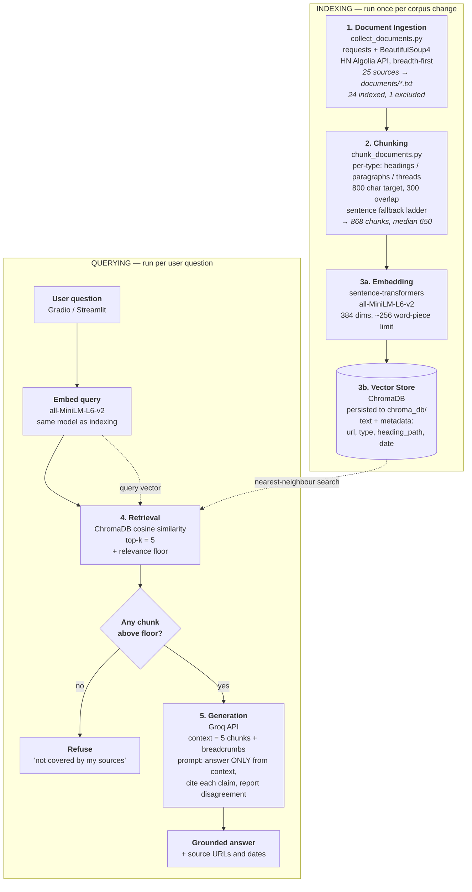

# Project 1 Planning: The Unofficial Guide

> Write this document before you write any pipeline code.
> Your spec and architecture diagram are what you'll use to direct AI tools (Claude, Copilot, etc.) to generate your implementation — the more specific they are, the more useful the generated code will be.
> Update the Retrieval Approach and Chunking Strategy sections if you change your approach during implementation.
> Update this file before starting any stretch features.

---

## Domain

<!-- What domain did you choose? Why is this knowledge valuable and hard to find through official channels? -->

New-grad software engineering interview preparation — what the hiring process at large tech
companies actually looks like from the candidate's side: how many rounds there are, what question
difficulty to expect, how long each stage takes, how much preparation is realistic, and how offers
are negotiated. Official company careers pages describe this process in deliberately general terms
— they publish "explain your thought process" advice but not the number of rounds, the realistic
onsite-to-decision timeline, or how strictly a given question is scored — so the operational detail
candidates need exists only in scattered first-hand accounts across forum threads, personal blog
postmortems, and aggregated interview data. That knowledge is also unusually perishable: the 2026
hiring market has shifted toward in-person rounds in response to AI-assisted cheating, which means
advice written even two years ago can be confidently wrong, and no official source flags which parts
have expired.

---

## Documents

<!-- List your specific sources: URLs, subreddit names, forum threads, or file descriptions.
     Aim for at least 10 sources that together cover different subtopics or perspectives within your domain. -->

| # | Source | Description | URL or location |
|---|--------|-------------|-----------------|
| 1 | Tech Interview Handbook (GitHub) | Long-form curated guide; covers resume, behavioral questions, coding best practices, negotiation. Clean Markdown, hierarchical headings. | https://github.com/yangshun/tech-interview-handbook |
| 2 | Tech Interview Handbook — SWE interview guide page | Rendered guide page covering the end-to-end interview process | https://www.techinterviewhandbook.org/software-engineering-interview-guide/ |
| 3 | System Design Primer (GitHub) | Long technical reference on system design interviews, incl. worked example solutions per system | https://github.com/donnemartin/system-design-primer |
| 4 | interviewing.io — "After a lot more data, technical interview performance really is kind of arbitrary" | Data analysis of 1000+ real interviews; argues single-interview outcomes are high-variance | https://interviewing.io/blog/after-a-lot-more-data-technical-interview-performance-really-is-kind-of-arbitrary |
| 5 | interviewing.io — "I've conducted over 600 technical interviews… 5 common problem areas" | Interviewer-side view of what candidates actually lose points on | https://interviewing.io/blog/ive-conducted-over-600-technical-interviews-on-interviewing-io-here-are-5-common-problem-areas-ive-seen |
| 6 | interviewing.io — "The technical interview practice gap" | Argues access to practice, not ability, drives outcomes; equity angle | https://interviewing.io/blog/technical-interview-practice-gap |
| 7 | interviewing.io — "We analyzed thousands of technical interviews on everything from language to code style" | Aggregate data on language choice, code style, and scoring | https://interviewing.io/blog/we-analyzed-thousands-of-technical-interviews-on-everything-from-language-to-code-style-here-s-what-we-found |
| 8 | Levels.fyi — Ultimate Negotiation Guide | ~3,000-word single-page guide on comp structure, leveling, negotiation dos/don'ts | https://www.levels.fyi/blog/ultimate-negotiation-guide.html |
| 9 | Levels.fyi Community — "New Grad Interview Experience (Expedia Group, Blue Origin, eBay)" | Short Q&A thread on LeetCode difficulty and whether interviewers give hints | https://www.levels.fyi/community/thread/1LBjuA/new-grad-interview-experience--expedia-group-blue-origin-ebay |
| 10 | Levels.fyi Community — "How I Studied For My Amazon Software Engineer Interview" | First-hand prep-timeline account (one year of study) | https://www.levels.fyi/community/thread/P2ow0q/how-i-studied-for-my-amazon-software-engineer-interview |
| 11 | Levels.fyi Community — "Interview with Meta, superficial and rushed?" | Negative/critical candidate experience — useful counterweight to guide-style optimism | https://www.levels.fyi/community/thread/WZHFPx/interview-with-meta-superficial-and-rushed |
| 12 | Levels.fyi Community — "Interview Process for New Grad at Netflix" | Company-specific process question (2022 — deliberately older, for staleness testing) | https://www.levels.fyi/community/thread/qhpgkj/interview-process-for-new-grad-at-netflix |
| 13 | Andrei Marchenko — "Cracking the FAANG Interview: my experience and recommendations in 2024" | Number-dense personal postmortem: 175 LeetCode problems (52E/106M/17H), 25 system design problems, 20+ behavioral stories, 3 attempts across 2021–2024 | https://amarchenko.dev/blog/2024-01-17-interview-experience/ |
| 14 | Hacker News — "AI killed the tech interview. Now what?" | 628-comment discussion; contrarian and practitioner takes on process changes. **Collected breadth-first, 124 of 628 comments** (60k char cap) to maximise distinct voices — see provenance note below | https://news.ycombinator.com/item?id=43108673 |
| 15 | Hacker News — "The Tech Hiring Process Is Broken" | **Not a discussion**: the thread drew only 2 comments, one a ~9,700-char first-person essay. Kept as a single long critique of the hiring process | https://news.ycombinator.com/item?id=39329929 |
| 16 | Computerworld — "To counter AI cheating, companies bring back in-person job interviews" | News analysis; Gartner stat that 72.4% of recruiting leaders use in-person interviews to detect fraud; names Google, Cisco, McKinsey | https://www.computerworld.com/article/4044734/to-counter-ai-cheating-companies-bring-back-in-person-job-interviews.html |
| 17 | Google Careers — official SWE interview prep guide | **Deliberate contrast source**: the official channel, to demonstrate what it does *not* specify | https://www.google.com/about/careers/applications/candidate-prep/swe |

**Sources still to add manually (not machine-fetchable):** r/cscareerquestions and r/leetcode
interview-experience threads. Reddit blocks automated crawlers, so these must be collected through a
browser or Reddit's own JSON endpoint (append `.json` to a thread URL) and saved into `documents/`.
They are the highest-volume source of per-company anecdotes, so at least 2–3 threads are worth the
manual effort. Blind and Glassdoor were considered and rejected: both are login-walled and their
terms prohibit scraping.

**Provenance note — how the big HN thread was sampled.** Source 14 has 628 comments, far more than
the 60,000-character budget allows. The collector walks the comment tree **breadth-first** rather
than depth-first, so the budget buys all top-level opinions before it buys any deep argument chains.
Measured effect at an identical cap:

| Traversal | comments kept | distinct authors | authors per comment |
|---|---|---|---|
| depth-first | 159 | 85 | 0.53 |
| **breadth-first** | **121** | **107** | **0.88** |

Breadth-first keeps 26% fewer comments but 26% more distinct people. Since the evaluation questions
are of the form "what do candidates *say* about X" — a plural question — diversity of voices is
worth more than completeness of any single argument thread. This is a deliberate sampling bias and
is disclosed as one: the corpus over-represents opening opinions and under-represents rebuttals.

**Coverage check** — each source group answers a different class of question, so the corpus is not 17
pages saying the same thing:

| Subtopic | Sources |
|---|---|
| Rounds, format, per-company process | 9, 11, 12, 17 |
| Question difficulty / what gets asked | 1, 2, 9 |
| Prep volume and timeline | 10, 13, 6 |
| What interviewers actually score | 4, 5, 7 |
| System design specifically | 3 |
| Behavioral / resume | 1, 2 |
| Compensation and negotiation | 8 |
| Criticism of the process itself | 14, 15 |
| 2026 AI-era shift | 14, 16 |
| Official baseline (contrast) | 17 |

---

## Chunking Strategy

<!-- How will you split documents into chunks?
     State your chunk size (in tokens or characters), overlap size, and explain why those
     numbers fit the structure of your documents.
     A review-heavy corpus warrants different chunking than a long FAQ. -->

**Chunk size:** 800 characters (target), with a hard fallback ladder so nothing exceeds it by more
than one sentence. Measured result across the corpus: **868 chunks, median 650 chars, max 1,079**.

**Overlap:** 300 characters, carried as **whole paragraphs** rather than a raw character slice.

**Minimum chunk size:** 100 characters (23 fragments dropped).

**Reasoning:**

Three numbers, each chosen against a measurement rather than a convention.

**Why 800 and not 400.** The hard ceiling is the embedding model: `all-MiniLM-L6-v2` truncates at
256 word-pieces, roughly 1,000 characters of English, and anything past that is silently invisible
to retrieval. So 1,000 is the ceiling. The floor came from measuring the corpus: **the median
paragraph is 266 characters.** An initial setting of 400 turned out to be *inert* — with a 400-char
target, two typical paragraphs (532 chars) always exceed it, so the packer emitted one paragraph per
chunk and merged nothing. Verified directly: **0 of 879 chunks contained more than one paragraph.**
Raising the target to 800 (3× the median paragraph) made packing actually work and recovered 25,585
characters of text that the minimum-size filter had previously been discarding.

**Why 300 overlap, in whole paragraphs.** Overlap exists so that a fact landing on a chunk boundary
survives intact in at least one chunk. Because the carry is measured in whole paragraphs, the
overlap budget must exceed the typical paragraph or nothing can ever be carried — at 200 characters
against a 266-character median, overlap fired on only **29% of chunk boundaries**. At 300 it clears
the median. Whole paragraphs rather than character slices because slicing mid-sentence produces
chunks that begin like `es to negotiate.`, which reads as broken to both a grader and the model.
The cost is 9% duplicated text, accepted deliberately.

**Why a fallback ladder was necessary.** `TARGET_CHARS` is a *flush threshold*, not a size cap: the
packing loop tests whether to emit the current chunk before appending the next paragraph, but never
rejects or splits the incoming paragraph. So the real ceiling was `overlap + largest paragraph`, and
**12% of chunks exceeded the target, the worst by 6.5×** (5,221 characters — of which the embedder
would read the first ~1,000). The fix is a ladder: paragraphs, then sentences if a paragraph exceeds
the target, then a hard character cut if a single sentence does. After that, max chunk size fell from
5,221 to **1,079** and chunks over 1,000 fell from 34 to **3**.

**Why chunking is per document type.** The corpus is structurally heterogeneous — 200x spread in
document size and three distinct shapes — so one strategy cannot serve all of it:

| Type | Strategy | Why |
|---|---|---|
| guide (Markdown, 10 docs) | split at headings, then pack paragraphs within each section | headings carry meaning that individual paragraphs lose (see breadcrumbs below) |
| blog / news (6 docs) | pack paragraphs | no headings survive the HTML conversion |
| thread (7 docs) | prepend the opening post to every chunk | the question and its answers live in different paragraphs |

**Heading breadcrumbs.** Every chunk stores the heading path it came from, e.g.
`Negotiation > Negotiation services > Rora`. This was added after finding a concrete failure: a chunk
reading `"Things Rora can do for you: - Help you negotiate increases..."` never says *what Rora is*.
The definition sat in the two headings above it. Carrying the breadcrumb fixes it for about 40
characters per chunk.

**Thread policy: the opening post is prepended to every chunk of a thread.** This is the breadcrumb
idea applied to conversation. It exists to defuse the `18-levels-newgrad-expedia.txt` trap documented
under Anticipated Challenges — the thread asks about Expedia, Blue Origin and eBay, and none of the
six replies mentions any of them. Prepending the question means a chunk of generic replies always
arrives with the specific question attached, so the model can see the replies do not actually answer
it, instead of silently attributing generic advice to a named company.

**Non-prose filtering, and a filter that had to be rewritten.** `system-design-primer` contains
markdown tables whose entire payload is URLs, plus a table of contents and a language switcher.
Chunked normally these produce chunks of pure link machinery. The first filter dropped any chunk that
was mostly markdown table rows — and that was **wrong**: it silently deleted the coding-rubrics
scoring table, the study-plan priority table, and the resume section-order table, which are among the
highest-information chunks in the corpus. Tables in these guides are *data*, not navigation. The
working rule measures the fraction of characters that are link machinery rather than words:

| Content | link-payload ratio |
|---|---|
| content tables and prose | 0.05 – 0.74 |
| link tables, TOC, language switcher | 0.81 – 0.99 |

Threshold set at **0.78**. The margin is narrow, so it is re-measured if sources are added. Final
count: 9 chunks dropped as non-prose, all from `system-design-primer`, verified by inspection.

**How I would know the chunks are wrong.** Too small shows up as chunks that fail a *standalone
test* — if handed only this chunk, could a reader answer anything? Symptoms are dangling pronouns
(`"he said"` with no name) and teaser sentences severed from their payoff, both of which appeared in
this corpus before packing. Too large shows up as the embedder truncation warning and as retrieval
returning topically-correct chunks whose relevant sentence is buried among 900 unrelated characters.

### Observations from reading the collected corpus (Milestone 1)

25 sources collected via `collect_documents.py` into `documents/`, **429,335 characters total**
(mean 17,173). Measured, not estimated — see `documents/_manifest.csv`.

**Size distribution is extreme.** Smallest usable document is 504 chars; largest is 109,682. That is
a **200x spread**, and it is the single most important fact about this corpus:

| Type | n | min | median | max |
|---|---|---|---|---|
| guide | 11 | 4,521 | 10,422 | 109,682 |
| blog | 5 | 9,945 | 18,772 | 24,789 |
| thread | 7 | 504 | 1,848 | 60,029 |
| news | 1 | 12,867 | — | — |
| official | 1 | 216 | — | — |

`10-system-design-primer.txt` alone is 109,682 chars — **26% of the entire corpus**. Under uniform
chunking it would contribute roughly a quarter of all chunks and dominate top-k for any
architecture-adjacent query. Either trim it to relevant sections or accept the imbalance knowingly.

**Structural markers differ by source, which decides what chunking can key on.** The 10 Markdown
guides retain their heading hierarchy (23 headings in the SWE guide, 172 in the system design
primer), so heading-aware splitting is viable for them. Every HTML-derived document has **zero**
Markdown headings and — because the collector currently drops blank lines — **zero paragraph
breaks**. That is a collector bug to fix before chunking: it destroys exactly the boundaries a
recursive splitter would want. HN threads are the cleanest of all, arriving as indented
`[author] text` with reply nesting preserved.

Three distinct document shapes turned up:

**1. Short forum threads (sources 9–12).** An original post of roughly 70–150 words followed by
2–7 replies of 1–3 sentences each. Critically, the useful facts are *distributed across separate
replies*, not contained in any one of them — in source 9, one reply supplies the difficulty level
("most leetcode style questions are usually mediums"), a different reply supplies whether hints are
given, and no single reply answers the original question completely. Chunking each reply
independently would therefore destroy the answer. These want **whole-thread chunks**, or at minimum
chunks that keep the original post attached to each reply for context.

**2. Long sectioned guides (sources 1–3, 8).** Levels.fyi's negotiation guide is ~3,000 words on a
single page under a three-level heading hierarchy; the GitHub handbooks are Markdown with deep
heading trees. Facts here are spread across paragraphs and depend on the section they sit in — a
"Don't" bullet is meaningless without the heading above it. These want **larger, heading-aware
chunks with overlap** so a section isn't severed mid-argument.

**3. Number-dense postmortems and data posts (sources 4–7, 13).** Source 13 is the opposite extreme:
key facts are isolated, countable, and highly specific (175 LeetCode problems split 52 easy / 106
medium / 17 hard; 25 system design problems; 20+ behavioral stories). The interviewing.io posts are
~1,500–2,000 words in ~6 headed sections with statistics scattered through prose. These tolerate
smaller chunks, but the statistics lose meaning if separated from the sentence that says what they
measure.

**Implication:** a single global chunk size will handle at most one of these three shapes well. The
likely approach is **chunking by document type**, with thread-level chunks for forum sources and
heading-delimited chunks with overlap for guides — and metadata on every chunk recording source
type, source URL, and **post date** (source 12 is from 2022 and describes a pre-2026 process, so
staleness needs to be visible at retrieval time).

### Two retrieval traps found by reading, not by measuring

Both of these would have been invisible from file sizes alone, and both are strong candidates for
the README's failure-case section.

**1. A topically perfect document containing no answer.**
`21-levels-netflix-newgrad.txt` (504 chars) is a question — *"what is the interview process for new
grad [at Netflix]?"* — with **zero replies**. It was viewed 2,609 times and answered by nobody. Its
text is an almost ideal semantic match for the query "how does Netflix interview new grads," so
retrieval will rank it highly, and it contains no information whatsoever. High similarity, zero
content.

**2. A thread that never answers its own question.**
`18-levels-newgrad-expedia.txt` asks specifically about **Expedia, Blue Origin, and eBay**. It has
six replies, and *not one of them mentions any of those three companies.* The replies discuss the
general market, AI cheating tools, and generic advice ("most leetcode style questions are usually
mediums", interviewers "will usually guide you in the right direction, or maybe even a hint"). So
a query about the Expedia new-grad loop will retrieve this document on the strength of its title and
opening post, and the generic claims sitting next to that title invite the model to attribute them
to Expedia specifically. **This is an attribution-hallucination trap, not a retrieval miss** — the
retrieval is working correctly and the output is still wrong.

### Cleaning defects to fix before chunking

1. **Blank lines are stripped**, so all 15 HTML-derived documents have no paragraph boundaries.
2. **Docusaurus frontmatter and JSX leak into the guides** — every Markdown file opens with a
   `---` YAML block (id, title, description, a `keywords:` list) plus a `<head><meta …/></head>`
   block. Roughly 20 lines of non-content per guide, and the `keywords` list is dense with exactly
   the domain terms queries will use, so it is *attractive* noise.
3. **levels.fyi threads carry interleaved chrome**: poster name, job title, employer/university, and
   bare vote-count integers on their own lines between replies, plus a trailing
   `About / Public / Members / 1,028,441` block.
4. **`25-google-official-prep.txt` is unusable as content** — 216 chars, entirely navigation labels
   (`Careers home Home work_outline Jobs noogler_hat Students`). The page is client-rendered and
   yielded 216 characters of text from 820KB of HTML. Recommendation: keep the file, **exclude it
   from the index**, and cite it in the writeup as evidence for the "official channels don't
   document this" claim — which it supports better by being empty than it would by being vague.

---

## Retrieval Approach

<!-- Which embedding model are you using (e.g., all-MiniLM-L6-v2 via sentence-transformers)?
     How many chunks will you retrieve per query (top-k)?
     If you were deploying this for real users and cost wasn't a constraint, what tradeoffs
     would you weigh in choosing a different embedding model — context length, multilingual
     support, accuracy on domain-specific text, latency? -->

**Embedding model:** `all-MiniLM-L6-v2` via `sentence-transformers`, run locally. 384 dimensions,
~256 word-piece input limit (the constraint that set the chunk-size ceiling above).

**Top-k:** 5, with `MAX_PER_SOURCE = 2` (at most two chunks from any one document) and a low
relevance floor of 0.35 — see below for why the floor cannot carry the scope decision on its own.

**Why 5.** With a median chunk of 624 characters, 5 chunks is roughly 3,100 characters of context —
enough for the model to see several independent voices on a question without burying the relevant
sentence. The tradeoff runs both ways. **Too few** (k=1–2) and a question whose answer sits in the
third-ranked chunk gets no answer at all, which is the likelier failure here because on-topic scores
are compressed into a narrow band (0.38 at the top) and ranking is therefore noisy. **Too many**
(k=10+) and the prompt fills with marginally-related text; since retrieval always returns its k
nearest chunks whether or not any are relevant, raising k mostly buys more irrelevant context and
measurably degrades answers. Because overlap duplicates 9% of the text, a further risk at high k is
that several of the k slots are near-copies of each other, so k=10 may deliver fewer than 10 distinct
facts. k=5 is a starting point to be tuned against the five evaluation questions, not a final answer.

**Why semantic search rather than keyword search.** Retrieval works by placing each chunk at a point
in 384-dimensional space, positioned so that text with similar meaning lands nearby, and then finding
the points nearest the query. This matters because the wording of a question rarely matches the
wording of its answer. Measured on this corpus: the query *"how much practice is enough before
applying?"* matched the chunk *"I studied for coding interview for an entire year"* at **0.384**
cosine similarity with **zero shared words**. Keyword search returns nothing for that pair.

**Measured limits of this model on this corpus.** Three results, all reproducible with
`scratch/embed_demo.py`:

| Test | Result | Implication |
|---|---|---|
| question → its real answer | **0.384** | on-topic scores are *low*; only ranking is meaningful, not absolute values |
| "grinding LeetCode is worth it" vs "…is a waste of time" | **0.888** | contradictions score 2.3× higher than genuine answers |
| "Is Blind 75 enough?" vs its plain-English paraphrase | **0.464** | domain jargon is largely unknown to the model |

The contradiction result is the important one: embeddings encode *topic*, and a claim and its denial
share a topic. In an opinionated corpus this means retrieval cannot be relied on to distinguish
advice from its rebuttal, so the generation prompt must surface disagreement rather than resolve it.

**Superseded by measurement on the real index.** The three figures in the table above were measured
on *isolated test sentences* before the index existed. Against the real 868-chunk index, all five
evaluation questions retrieve their verified answer and the scores are roughly **double**: 0.674,
0.728, 0.737, 0.516, 0.665. Real chunks carry surrounding context, so they match questions far better
than single sentences do. The relative findings (contradictions score high, jargon scores low) still
hold; the absolute values do not. Reproduce with `test_retrieval.py`.

**Why the relevance floor cannot decide scope — measured, and not what was first assumed.** A floor
tuned against only the five crisp factual evaluation questions looked comfortable: worst in-scope
0.542 versus best out-of-scope 0.440, a window of +0.102, and 0.48 sat neatly inside it. That was an
artifact of the question set. Widening the test to 10 in-domain questions phrased abstractly and 6
out-of-domain questions collapses the window:

| | score | question |
|---|---|---|
| lowest in-domain | **0.451** | "Should I take the first offer?" |
| highest out-of-domain | **0.460** | "What are good interview questions for a nursing job?" |
| window | **−0.009** | the bands overlap |

The 0.48 floor *falsely refused* "Is grinding LeetCode worth the time?" (0.461), a squarely in-domain
question. **No single cutoff separates in-scope from out-of-scope on this corpus**, because adjacent
domains — nursing interviews, rent negotiation, LSAT prep — share both vocabulary and question shape
with software interview prep.

The design that follows: **refusal is two-stage.** `RELEVANCE_FLOOR = 0.35` rejects only queries with
no plausible relationship to the corpus ("capital of Australia" 0.161, "leaking kitchen tap" 0.185).
Everything above it goes to the LLM, which can read the retrieved text and see that
software-engineering interview advice does not answer a nursing question — a judgement a cosine
distance cannot make.

**Per-source diversity cap.** `MAX_PER_SOURCE = 2`. Without it, question 3 returned five chunks from
the same forum thread, each repeating the same prepended opening post — five top-k slots delivering
one document's worth of information. Overlap and the thread policy both duplicate text by design, so
near-identical neighbours crowd out other sources unless capped.

**A tested alternative that did not work.** `multi-qa-MiniLM-L6-cos-v1` is trained specifically for
question→passage retrieval, so it looked like an obvious upgrade. Measured at the same cap it made
the problem **worse**: the off-topic query scored 0.405 against a best on-topic score of 0.395, i.e.
the gap went *negative* (−0.010). Its sharper question-matching amplified the false positive rather
than suppressing it, because it correctly identified negotiation advice as the best available answer
to a negotiation question — it has no way to know tech-offer and mortgage negotiation are different
domains. General lesson recorded for the writeup: **cosine similarity cannot distinguish "right
topic, wrong domain," and a better retrieval model improves plausible-but-wrong matches too.** The
caveat is that this comparison ran on short test sentences, not full chunks; it will be re-run
against the real 868-chunk index before the model choice is final.

**Production tradeoff reflection.** If this were deployed for real users with cost not a constraint,
the tradeoffs I would weigh, in order of what actually hurt here:

1. **Context length.** The 256 word-piece limit is what forced an 800-character chunk ceiling, and
   that ceiling is what forced the whole fallback ladder. A model with an 8k context (e.g. OpenAI
   `text-embedding-3-large`, Voyage, Cohere Embed v3) would let a chunk be a whole thread or a whole
   guide section, which would eliminate most of the standalone-test failures in one move.
2. **Domain vocabulary.** The 0.464 result on "Blind 75" is a direct measurement of the model not
   knowing this domain. A larger general model helps somewhat; fine-tuning on interview-prep text, or
   a hybrid that combines semantic search with keyword matching (BM25) to catch exact jargon like
   `E5` and `Blind 75`, would help more.
3. **Asymmetric retrieval.** Question→passage is a different task from sentence similarity. The
   right fix is probably a model with explicit query/passage prefixes (E5, BGE) rather than the
   `multi-qa` swap that failed above — but on the evidence here I would insist on measuring it
   rather than assuming.
4. **Latency and privacy.** Local embedding is free, offline, and has no per-query cost or rate
   limit, which is why it is right for this project. An API model adds a network round trip per
   query and sends user questions to a third party — acceptable for a product, unnecessary here.
5. **Multilingual support.** Not a factor: the corpus is entirely English. Worth noting because
   `system-design-primer` has translated READMEs whose language-switcher rows are dropped by the
   non-prose filter.

---

## Evaluation Plan

<!-- List your 5 test questions with their expected correct answers.
     Questions should be specific enough that you can judge whether the system's response
     is right or wrong. "What are good dining halls?" is too vague.
     "What do students say about wait times at [dining hall name] during lunch?" is testable. -->

Every expected answer below was **verified to exist verbatim in the collected documents** before
being written here, and each names the file it can be checked against. None of them is a matter of
opinion — each is either a number, a named difficulty level, or a yes/no with a stated reason.

| # | Question | Expected answer | Verifiable in |
|---|----------|-----------------|---------------|
| 1 | How many LeetCode problems did an engineer report solving before passing a FAANG interview, and what was the difficulty split? | 175 total — 52 easy, 106 medium, 17 hard. (Same source also reports 25 system design problems.) | `16-marchenko-postmortem.txt`: *"solved a total of 175 LeetCode tasks (52 easy, 106 medium, 17 hard)"* |
| 2 | What share of recruiting leaders are conducting interviews in person to combat candidate fraud? | 72.4% | `17-computerworld-ai-cheating.txt`: *"72.4% of recruiting leaders reported they are currently conducting interviews in-person to combat fraud"* |
| 3 | What difficulty are LeetCode questions in entry-level interviews, and do interviewers give hints? | Mostly mediums; interviewers usually guide you toward the right direction or give a hint, provided you explain your thought process. | `18-levels-newgrad-expedia.txt`: *"most leetcode style questions are usually mediums"* / *"they will usually guide you in the right direction, or maybe even a hint"* |
| 4 | Is the first offer a company gives the best package they can offer? | No — the initial offer is never the best package, and recruiters expect candidates to negotiate. | `07-negotiation.txt`: *"The initial offer that you are given is never the best package that the company can offer"* |
| 5 | How much more often do women abandon interview practice than men after a single bad interview? | 7 times more often | `13-iio-practice-gap.txt`: *"women quit interview practice 7 times more often than men after just one bad interview"* |

**Out-of-scope control question** (should be refused, not answered): *"What is the best way to
negotiate a mortgage rate?"* Chosen deliberately rather than at random: on the real index it scores
**0.440**, above four legitimate in-domain questions, because "negotiate" is shared vocabulary with
the negotiation sources. An even harder control has since been added — *"What are good interview
questions for a nursing job?"* at **0.460**, which outscores every abstractly-phrased in-domain
question tested. Both pass the 0.35 floor by design and must be refused by the grounding prompt.

**Two questions rejected while writing this section**, for the reason the brief warns about:

- *"Is grinding LeetCode worth it?"* — the corpus contains directly opposing answers, so there is no
  single correct response to grade against. Retained instead as a **disagreement test**: the system
  should report that sources conflict rather than pick a side.
- *"What is the average technical interview score?"* — I had noted "2.85 out of 4" from a search
  snippet, then grepped the collected documents and **could not find it**. The figure is not in the
  corpus, so it cannot be an expected answer. Recorded here as a reminder that expected answers must
  be checked against the fetched text, not against recollection.

---

## Anticipated Challenges

<!-- What could go wrong? Name at least two specific risks with reasoning.
     Consider: noisy or inconsistent documents, missing source attribution, off-topic
     retrieval, chunks that split key information across boundaries. -->

1. **Attribution hallucination from company-specific queries.** Demonstrated in
   `18-levels-newgrad-expedia.txt` above: a thread titled for three named companies whose replies
   discuss none of them. Retrieval will surface it for any query naming those companies, and the
   generic advice adjacent to the specific title is exactly the raw material for a confident wrong
   answer. Mitigation: keep the thread's question and replies in one chunk so the model can see that
   the replies don't address the title, and require per-claim source attribution in the prompt.

2. **A single document dominating retrieval.** `10-system-design-primer.txt` is 26% of the corpus by
   character count. Uniform chunking gives it ~26% of all chunks, so it will crowd top-k for a wide
   range of queries regardless of whether it is the best source. Mitigation: either trim it to the
   sections in scope, or cap chunks retrieved per source document.

3. **Contradiction is invisible to retrieval.** Measured directly on this corpus's vocabulary:
   "Grinding LeetCode is absolutely worth your time" and "Grinding LeetCode is a waste of your time"
   score **0.888** cosine similarity under `all-MiniLM-L6-v2`, while a genuine question-to-answer
   match scored only **0.384**. Embeddings encode topic, and a claim and its denial share a topic.
   With a corpus this opinionated, retrieval cannot be relied on to distinguish advice from its
   rebuttal — the generation prompt has to surface disagreement rather than resolve it.

4. **Out-of-scope refusal is not solvable by score thresholding — now confirmed on the real index.**
   Measured over 10 in-domain and 6 out-of-domain questions against the 868-chunk index: the lowest
   in-domain score (0.451, *"Should I take the first offer?"*) sits **below** the highest
   out-of-domain score (0.460, *"What are good interview questions for a nursing job?"*). The window
   is **−0.009** — the bands overlap, so any cutoff either admits the nursing question or refuses a
   legitimate negotiation question. A floor of 0.48, tuned against the five factual evaluation
   questions alone, falsely refused *"Is grinding LeetCode worth the time?"* at 0.461. Mitigation:
   two-stage refusal — a low floor (0.35) to reject the obviously unrelated, then the grounding
   prompt to reject adjacent domains by reading whether the retrieved text actually answers the
   question.

5. **The disagreement test is weaker than assumed.** *"Is grinding LeetCode worth the time?"*
   retrieves a top hit of 0.461 about mastering data structures — not an argument for or against
   grinding. The corpus contains opposing views on this, but they are not reachable by that phrasing,
   so the planned "reports disagreement" demonstration may need a differently-worded query or a
   different topic. Recorded rather than quietly dropped.

---

## Architecture

<!-- Draw a diagram of your pipeline showing the five stages:
     Document Ingestion → Chunking → Embedding + Vector Store → Retrieval → Generation
     Label each stage with the tool or library you're using.
     You can use ASCII art, a Mermaid diagram, or embed a sketch as an image.
     You'll use this diagram as context when prompting AI tools to implement each stage. -->

The pipeline splits into two phases that run at different times: **indexing** happens once whenever
the documents change, **querying** happens on every user question.

**Same model on both sides is not optional.** The query is embedded with `all-MiniLM-L6-v2` because
the chunks were — two different models produce coordinates in unrelated spaces, so distances between
them would be meaningless.

**The relevance floor is the refusal mechanism.** Retrieval always returns its 5 nearest chunks
whether or not any are relevant, so the decision diamond, not the prompt, is what makes out-of-scope
refusal deterministic. Per the measurement in Retrieval Approach, the floor alone may be
insufficient (0.061 of separation), so the generation prompt is a second line of defence.

---

## AI Tool Plan

<!-- For each part of the pipeline below, describe:
     - Which AI tool you plan to use (Claude, Copilot, ChatGPT, etc.)
     - What you'll give it as input (which sections of this planning.md, which requirements)
     - What you expect it to produce
     - How you'll verify the output matches your spec

     "I'll use AI to help me code" is not a plan.
     "I'll give Claude my Chunking Strategy section and ask it to implement chunk_text()
     with my specified chunk size and overlap" is a plan. -->

**Tool used: Claude (Claude Code in VSCode)** for all three milestones, because it can read the
repository and run the scripts, which makes verification concrete rather than a matter of reading
generated code and hoping.

**The working pattern, which is the actual plan.** Rather than asking for a finished file, the loop
is: (1) I state the decision and the constraint; (2) Claude explains the logic and gives an example
of the shape the code should take; (3) Claude writes the plumbing and leaves the decision-carrying
functions as `TODO(you)` stubs; (4) I fill those in and run it; (5) **the script prints diagnostics
and I read them**, then adjust. Step 5 is the verification, and it is where every real problem has
been caught so far.

**Milestone 3 — Ingestion and chunking.**
*Input given:* the Documents table and Chunking Strategy section from this file, plus the constraint
that `all-MiniLM-L6-v2` truncates at ~256 word-pieces.
*Expected output:* `collect_documents.py` (fetch + clean + metadata headers) and
`chunk_documents.py` with `pack_paragraphs()` left blank for me to write.
*How it was verified:* the chunker prints chunk count, min/median/max size, a warning for chunks
over 1,000 characters, a count of what was dropped, and **samples of the dropped text**. Reading
those samples caught three real defects that no error message would have surfaced —
(a) `TARGET_CHARS = 400` made packing completely inert (0 of 879 chunks merged more than one
paragraph); (b) the non-prose filter was silently deleting the coding-rubrics and study-plan tables,
the highest-value content in the corpus; (c) the opening-post budget let one 9,680-character
paragraph through whole, producing a 9,822-character chunk. Each was found by inspecting output, not
by reading the code.
*What I overrode:* the first non-prose rule ("drop chunks that are mostly markdown table rows") was
plausible and wrong; it was replaced with a link-payload ratio validated against a measured
separation (content 0.05–0.74 vs navigation 0.81–0.99).

**Milestone 4 — Embedding and retrieval.**
*Input to give:* the Retrieval Approach section, the 868-chunk `chunks.json`, the chunk metadata
schema, and the five evaluation questions.
*Expected output:* an `index.py` that embeds chunks and upserts them into ChromaDB with metadata
intact, and a `query.py` that embeds a question, retrieves top-k, applies the relevance floor, and
prints scores alongside chunks.
*How I will verify:* run the five evaluation questions and check that the chunk containing the
verified answer appears in the top 5 — the expected answers in the Evaluation Plan each name the
file they live in, so this is a direct check rather than a judgement call. Then run the out-of-scope
mortgage question and confirm every score falls below the floor. Retrieval gets tested **before** any
LLM is involved, because a wrong answer from correct chunks and a wrong answer from missing chunks
are different bugs with different fixes.
*Where I expect to override:* the relevance floor. The measured separation is only 0.061, so I
expect the first threshold Claude proposes to be either too permissive or to refuse valid questions,
and to have to tune it against the five questions plus the control.

**Milestone 5 — Generation and interface.**
*Input to give:* the Grounded Generation requirements from README.md, the retrieval output format
from Milestone 4, and the contradiction measurement (0.888 for opposing claims) as an explicit
requirement that the prompt must surface disagreement rather than resolve it.
*Expected output:* a system prompt that restricts the model to the supplied context and requires
per-claim attribution, plus a Gradio interface showing the answer with source URLs and fetch dates.
*How I will verify:* the two grounded responses and one refusal required by README.md, checked by
confirming each cited claim actually appears in the cited chunk; plus deliberately feeding it the
`18-levels-newgrad-expedia.txt` trap ("what is the Expedia new-grad interview like?") to check it
says the replies do not address Expedia rather than attributing generic advice to it.
*What I will not delegate:* the prose in this file and in README.md, and the choice of what counts
as a failure. Claude's measurements are reproducible via the scripts in `scratch/`, but the
judgement about which tradeoffs were acceptable is mine to defend.
